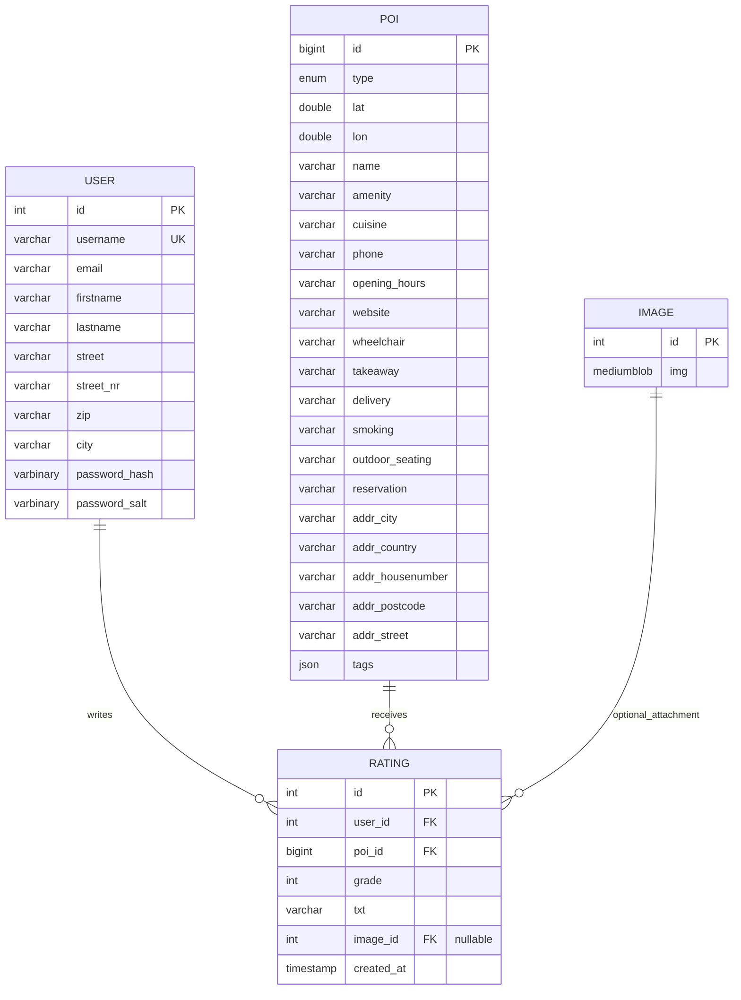

## ER Model

### Relationship Explanation

A `user` can write many ratings. Each rating belongs to exactly one user.

A `poi` can receive many ratings. Each rating belongs to exactly one POI.

A rating can optionally contain an image. This is represented by the nullable foreign key `rating.image_id`.

### Dependencies

| Relationship       | Foreign Key                             | Meaning                                  |
| ------------------ | --------------------------------------- | ---------------------------------------- |
| `user` → `rating`  | `rating.user_id` references `user.id`   | A rating must belong to an existing user |
| `poi` → `rating`   | `rating.poi_id` references `poi.id`     | A rating must belong to an existing POI  |
| `image` → `rating` | `rating.image_id` references `image.id` | A rating may optionally have an image    |

## REST Use Cases And DTO Planning

| Use Case        | Frontend Sends                                                | Backend Returns                                              |
| --------------- | ------------------------------------------------------------- | ------------------------------------------------------------ |
| Register user   | Username, email, firstname, lastname, address data, password  | Session token and user information                           |
| Login user      | Username and password                                         | Session token and user information                           |
| Logout user     | Session token                                                 | Success message                                              |
| Load map        | Session token                                                 | List of POIs with id, name, latitude, longitude, and amenity |
| Select POI      | POI id and session token                                      | POI details and existing ratings                             |
| Create rating   | POI id, grade, comment text, optional image, session token    | Created rating                                               |
| Load my ratings | Session token                                                 | List of ratings created by the logged-in user                |
| Edit rating     | Rating id, grade, comment text, optional image, session token | Updated rating                                               |
| Delete rating   | Rating id and session token                                   | Success message                                              |
| Delete user     | Session token                                                 | Success message, user and related ratings are deleted        |

## DTO Idea

Entities represent the database tables. DTOs represent the data exchanged between frontend and backend.

| DTO                   | Purpose                                                         |
| --------------------- | --------------------------------------------------------------- |
| `RegisterRequest`     | Data needed to create a new user                                |
| `LoginRequest`        | Data needed to log in                                           |
| `LoginResponse`       | Session token and basic user information after successful login |
| `CurrentUserDto`      | Basic information about the logged-in user                      |
| `PoiOverviewDto`      | Small POI data for displaying markers on the map                |
| `PoiDetailDto`        | Detailed POI data after selecting a marker                      |
| `RatingDto`           | Rating data shown for a selected POI                            |
| `CreateRatingRequest` | Data needed to create a rating                                  |
| `UpdateRatingRequest` | Data needed to edit a rating                                    |
| `MyRatingDto`         | Rating data shown in the "My Ratings" tab                       |
