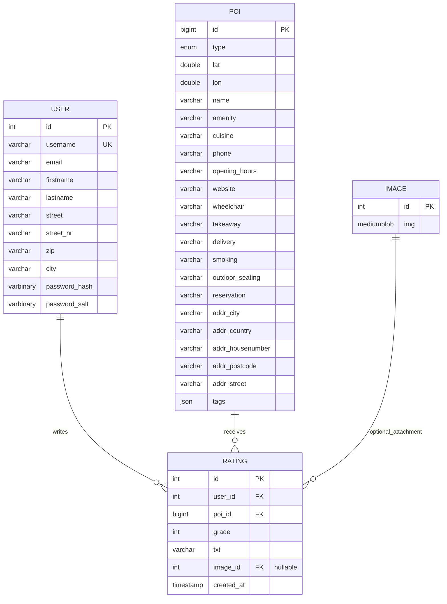

## ER Model

### Relationship Explanation

A `user` can write many ratings. Each rating belongs to exactly one user.

A `poi` can receive many ratings. Each rating belongs to exactly one POI.

A rating can optionally contain an image. This is represented by the nullable foreign key `rating.image_id`.

### Dependencies

| Relationship | Foreign Key | Meaning |
|---|---|---|
| `user` → `rating` | `rating.user_id` references `user.id` | A rating must belong to an existing user |
| `poi` → `rating` | `rating.poi_id` references `poi.id` | A rating must belong to an existing POI |
| `image` → `rating` | `rating.image_id` references `image.id` | A rating may optionally have an image |
