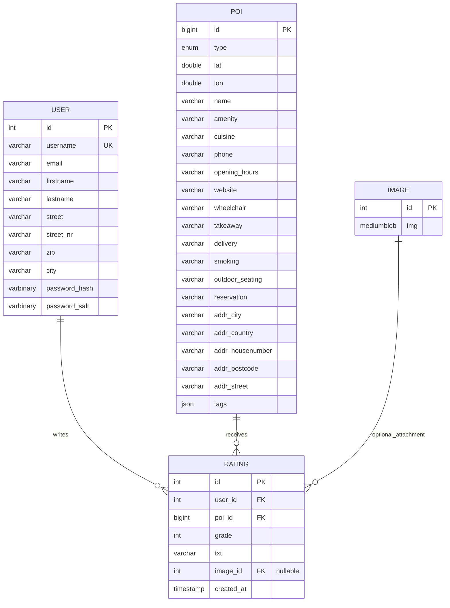
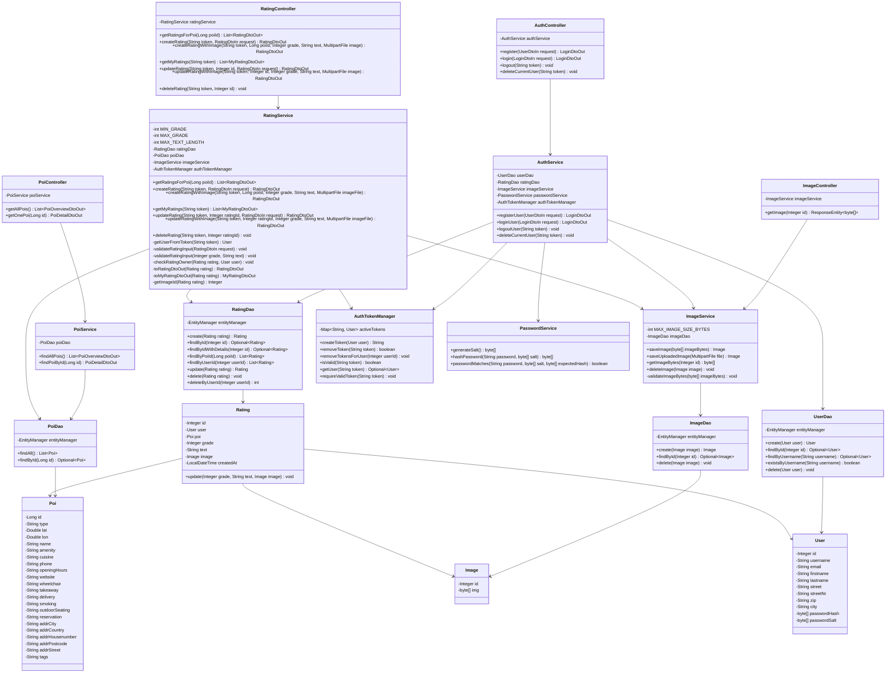
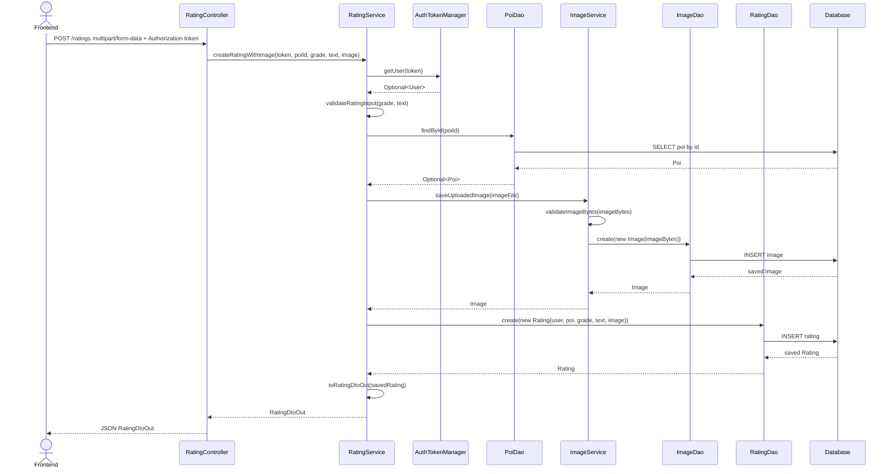
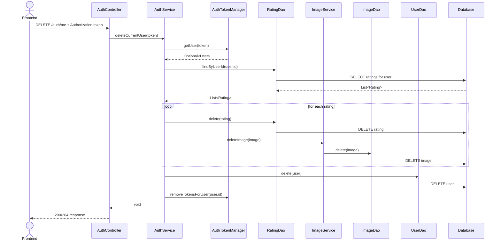

# RateMe

RateMe is a Spring Boot REST application with a plain HTML/CSS/JavaScript frontend planned for rating POIs such as restaurants, cafes, and pubs around Zweibruecken.

## ER Model



### Relationship Explanation

A `user` can write many ratings. Each rating belongs to exactly one user.

A `poi` can receive many ratings. Each rating belongs to exactly one POI.

A rating can optionally contain an image. This is represented by the nullable foreign key `rating.image_id`.

### Dependencies

| Relationship        | Foreign Key                             | Meaning                                  |
| ------------------- | --------------------------------------- | ---------------------------------------- |
| `user` -> `rating`  | `rating.user_id` references `user.id`   | A rating must belong to an existing user |
| `poi` -> `rating`   | `rating.poi_id` references `poi.id`     | A rating must belong to an existing POI  |
| `image` -> `rating` | `rating.image_id` references `image.id` | A rating may optionally have an image    |

## REST Use Cases And DTO Planning

| Use Case        | Frontend Sends                                                | Backend Returns                                              |
| --------------- | ------------------------------------------------------------- | ------------------------------------------------------------ |
| Register user   | Username, email, firstname, lastname, address data, password  | Session token and user information                           |
| Login user      | Username and password                                         | Session token and user information                           |
| Logout user     | Session token                                                 | Success message                                              |
| Load map        | Session token                                                 | List of POIs with id, name, latitude, longitude, and amenity |
| Select POI      | POI id and session token                                      | POI details and existing ratings                             |
| Create rating   | POI id, grade, comment text, optional image, session token    | Created rating                                               |
| Load my ratings | Session token                                                 | List of ratings created by the logged-in user                |
| Edit rating     | Rating id, grade, comment text, optional image, session token | Updated rating                                               |
| Delete rating   | Rating id and session token                                   | Success message                                              |
| Delete user     | Session token                                                 | Success message, user and related ratings are deleted        |

## DTO Idea

Entities represent the database tables. DTOs represent the data exchanged between frontend and backend.

| DTO | Purpose |
| --- | ------- |
| `UserDtoIn` | Input data needed to create a new user |
| `LoginDtoIn` | Input data needed to log in |
| `LoginDtoOut` | Output data after successful login or registration |
| `UserDtoOut` | Safe user data returned to the frontend |
| `PoiOverviewDtoOut` | Small POI output data for displaying markers on the map |
| `PoiDetailDtoOut` | Detailed POI output data after selecting a marker |
| `RatingDtoIn` | Input data needed to create a rating |
| `RatingDtoOut` | Output rating data shown for a selected POI |
| `RatingUpdateDtoIn` | Input data needed to edit a rating |
| `MyRatingDtoOut` | Output rating data shown in the "My Ratings" tab |

## Backend Architecture

The backend is built as a Spring Boot REST application. The code is separated into layers so that each class has one clear responsibility.

```text
Frontend
   ↓
Controller
   ↓
Service
   ↓
DAO
   ↓
Database
```

### Package Structure

| Package      | Responsibility                                                                          |
| ------------ | --------------------------------------------------------------------------------------- |
| `controller` | REST endpoints. Controllers receive HTTP requests and return DTOs as JSON.              |
| `service`    | Application logic. Services decide what the app should do and convert entities to DTOs. |
| `dao`        | Manual database access with JPA `EntityManager`. No Spring Data repositories are used.  |
| `entity`     | Java classes mapped to database tables.                                                 |
| `dto`        | Java records used for REST request and response data.                                   |
| `auth`       | Authentication helper logic, for example password hashing and token handling.           |

### Layer Responsibilities

Controllers should only handle HTTP:

```text
URL + HTTP method + call service + return result
```

Services contain the app rules:

```text
validate input
handle not-found cases
convert entities to DTOs
coordinate DAO classes
```

DAO classes talk to the database:

```text
EntityManager queries
persist
find
update
delete
```

Entities represent database rows:

```text
poi table    -> Poi entity
user table   -> User entity
rating table -> Rating entity
image table  -> Image entity
```

DTOs represent API data:

```text
Poi entity  -> PoiOverviewDtoOut
Poi entity  -> PoiDetailDtoOut
User entity -> UserDtoOut
```

Sensitive fields such as `password_hash` and `password_salt` are never sent to the frontend.

## Backend Class Diagram



## Backend Communication Diagrams

### Create Rating With Image



### Delete Current User



## Current Backend Status

### User DAO

`UserDao` is responsible for database access to the `user` table.

Current responsibilities:

```text
create a user
find a user by id
find a user by username
check whether a username already exists
```

Password hashing is not done in `UserDao`, because database access and authentication logic are separate responsibilities.

### Password Handling

`PasswordService` is responsible for password-related security logic.

Current responsibilities:

```text
generate random salt
hash password with salt
compare entered password with stored password hash
```

The application does not store plain text passwords. During registration, the backend creates:

```text
password_salt
password_hash
```

During login, the backend hashes the entered password again with the stored salt and compares the result with the stored hash.

### Token Handling

`AuthTokenManager` stores active login tokens in memory.

Current responsibilities:

```text
create a UUID token
store token -> user
remove a token on logout
check whether a token is valid
find the user for a token
reject invalid tokens with 401 Unauthorized
```

This is a simple custom token mechanism and not JWT.

## Backend Rules From The Lecture Notes

The implementation follows the lecture style:

| Rule                       | Implementation Direction                                                           |
| -------------------------- | ---------------------------------------------------------------------------------- |
| Use REST resources         | Endpoints use nouns such as `/pois` instead of verbs like `/getPois`.              |
| Use HTTP methods correctly | `GET` for reading, `POST` for creating, `PUT` for updating, `DELETE` for deleting. |
| Use DTO records            | REST request and response objects are Java records.                                |
| Use JPA manually           | DAO classes use `EntityManager`.                                                   |
| No Spring Data             | No `JpaRepository` or `CrudRepository`.                                            |
| No Spring Security/JWT     | Authentication uses a custom token mechanism.                                      |
| Store passwords safely     | Passwords are stored as hash + salt, never as plain text.                          |

tests for DAO and controller classes

```

```
